# Project Overview - TabSage

**NOTE**: This is a submission for the Google AI Agents Intensive Capstone project. This project demonstrates a complete multi-agent system built using Google Agent Development Kit (ADK).

This project contains the core logic for TabSage, a multi-agent system designed to automatically process articles, extract knowledge, build dynamic knowledge graphs, and generate audio podcasts. The system is built using Google Agent Development Kit (ADK) and follows a modular architecture with 12 specialized agents.

[](https://www.python.org/)
[](https://github.com/google/adk-python)
[](https://cloud.google.com/vertex-ai)

## Architecture

### Problem Statement

In today's information age, we face an overwhelming deluge of content. Thousands of articles are published daily across countless domains - from scientific research to news analysis, from educational content to industry insights. This information overload creates several critical challenges:

**Real-World Impact**: Consider a typical knowledge worker's situation:
- **800+ videos** in YouTube backlog waiting to be processed
- **4000+ browser tabs** saved in OneTab and bookmark managers across different topics
- **Constant information flow**: New news, events, laws, important updates, and hobby-related content arriving daily, weekly, monthly
- **Professional needs**: Conference presentations require gathering research materials, studying new topics demands systematic organization
- **Information chaos**: Work-related updates, life events, legal changes, important news, and personal interests all competing for attention

This creates several critical challenges:

1. **Information Fragmentation**: Related articles and concepts are scattered across different sources, making it difficult to see connections and build comprehensive understanding. With thousands of tabs and bookmarks, finding related information becomes nearly impossible.

2. **Time-Intensive Processing**: Manually reading, extracting key ideas, and organizing information from multiple articles requires hours of work per week. Reading and processing 10 articles takes 5-8 hours, extracting key ideas manually takes 2-3 hours, and organizing information takes 1-2 hours - totaling 8-13 hours per week. With hundreds of articles in backlog, this becomes unsustainable.

3. **Knowledge Loss**: Without systematic organization, valuable insights and relationships between concepts are lost or forgotten. Connections between articles are missed, and it becomes difficult to search and retrieve information. Important research for conferences gets buried in the backlog.

4. **Accessibility Barriers**: Text-based content excludes those who prefer audio learning or need accessibility accommodations. Processing articles while commuting or during other activities becomes impossible.

5. **No Visual Representation**: Traditional reading doesn't provide visual understanding of how concepts relate to each other. Research materials for presentations remain disconnected and hard to synthesize.

**The Core Question**: How can we automate the process of extracting knowledge from articles, organizing it into a structured knowledge graph, and making it accessible through multiple formats - transforming information chaos into organized, searchable knowledge?

### Solution Statement

TabSage is a multi-agent AI system that automatically processes articles, extracts entities and relationships, builds dynamic knowledge graphs, and generates audio podcasts - transforming unstructured text into organized, accessible knowledge.

Agents can automatically:
- **Process Articles**: Accept article URLs via Telegram bot, scrape content, normalize text, and split into manageable chunks
- **Extract Knowledge**: Identify entities (people, organizations, concepts, events, locations) and relationships between them using specialized agents
- **Build Knowledge Graphs**: Store extracted knowledge in Firestore with persistent storage and visualization through web interface
- **Generate Summaries**: Create structured summaries with key insights, intents, values, and trends
- **Create Audio Podcasts**: Generate NotebookLM-style audio podcasts with two AI hosts discussing the content
- **Enable Semantic Search**: Search across the entire knowledge base with semantic understanding

This multi-agent approach transforms article processing from a manual 8-13 hour per week task into an automated 30-40 minute per week process - saving 7-12 hours per week (85-90% reduction).

### Architecture

Core to TabSage is the multi-agent system - not a monolithic application but an ecosystem of 12 specialized agents, each contributing to a different stage of the knowledge extraction and organization process. This modular approach, facilitated by Google's Agent Development Kit, allows for a sophisticated and robust workflow.



**Visual Architecture Diagram**: See [architecture.svg](architecture.svg) for a detailed visual representation of the system.

The central orchestrator of this system is the `Orchestrator`, which coordinates the work of all agents. The system follows this flow:

```mermaid
graph TB
    subgraph UserInterface[User Interfaces]
        Telegram[Telegram Bot]
        WebUI[Web Interface]
    end
    
    subgraph EntryPoint[Entry Point]
        IntentAgent[Intent Recognition Agent]
    end
    
    subgraph ProcessingPipeline[Article Processing Pipeline]
        WebScraper[Web Scraper Tool]
        IngestAgent[Ingest Agent]
        KGBuilderAgent[KG Builder Agent]
        SummaryAgent[Summary Agent]
    end
    
    subgraph DiscoveryPipeline[Topic Discovery & Audio Pipeline]
        TopicDiscoveryAgent[Topic Discovery Agent]
        ScriptwriterAgent[Scriptwriter Agent]
        AudioProducerAgent[Audio Producer Agent]
        PublisherAgent[Publisher Agent]
    end
    
    subgraph QualityPipeline[Quality Assurance Pipeline]
        EvaluatorAgent[Evaluator Agent]
        EditorAgent[Editor Agent]
    end
    
    subgraph ExpertSystem[Expert System]
        GuestAgent[Guest Agent]
    end
    
    subgraph Orchestration[Orchestration]
        Orchestrator[Orchestrator Agent]
    end
    
    subgraph ToolsLayer[Tools Layer]
        NLP[NLP Tools<br/>- Text cleaning<br/>- Chunking<br/>- Language detection]
        NER[NER & Entity Linking<br/>- Entity extraction<br/>- Entity normalization<br/>- Entity linking]
        Embeddings[Embeddings<br/>- Vertex AI Embeddings]
        TTS[TTS<br/>- Google Cloud TTS<br/>- SSML support]
        AudioUtils[Audio Utils<br/>- Normalization<br/>- Mixing<br/>- Segmentation]
        Cache[Cache<br/>- Function caching]
    end
    
    subgraph StorageLayer[Storage Layer]
        FirestoreKG[(Firestore<br/>Knowledge Graph)]
        FirestoreMemory[(Firestore<br/>Memory Service)]
        SharedMemory[Shared Memory<br/>Inter-agent communication]
    end
    
    subgraph ObservabilityLayer[Observability Layer]
        Logging[Structured Logging<br/>JSON logs]
        Tracing[OpenTelemetry<br/>Distributed tracing]
        Metrics[Prometheus<br/>Metrics on port 8000]
    end
    
    subgraph CommunicationLayer[Communication Layer]
        A2A[A2A Protocol<br/>Agent-to-Agent]
        Registry[Vertex AI<br/>Agent Registry]
        RemoteAgents[Remote Agents<br/>HTTP endpoints]
    end
    
    subgraph SearchLayer[Search Layer]
        SemanticSearch[Semantic Search<br/>Vertex AI Search]
        GraphSearch[Graph Search<br/>Firestore queries]
    end
    
    %% User Interface Connections
    Telegram --> IntentAgent
    WebUI --> FirestoreKG
    WebUI --> GraphSearch
    
    %% Entry Point to Pipelines
    IntentAgent -->|URL| ProcessingPipeline
    IntentAgent -->|Search| SearchLayer
    IntentAgent -->|Audio| DiscoveryPipeline
    
    %% Processing Pipeline Flow
    ProcessingPipeline --> WebScraper
    WebScraper --> IngestAgent
    IngestAgent --> KGBuilderAgent
    IngestAgent --> SummaryAgent
    KGBuilderAgent --> FirestoreKG
    SummaryAgent --> FirestoreKG
    
    %% Discovery Pipeline Flow
    FirestoreKG --> TopicDiscoveryAgent
    TopicDiscoveryAgent --> ScriptwriterAgent
    ScriptwriterAgent --> AudioProducerAgent
    AudioProducerAgent --> PublisherAgent
    ScriptwriterAgent --> EditorAgent
    EditorAgent --> EvaluatorAgent
    
    %% Quality Pipeline
    EvaluatorAgent --> EditorAgent
    EditorAgent --> ScriptwriterAgent
    
    %% Expert System
    FirestoreKG --> GuestAgent
    GuestAgent --> SharedMemory
    
    %% Orchestration
    Orchestrator --> ProcessingPipeline
    Orchestrator --> DiscoveryPipeline
    Orchestrator --> QualityPipeline
    
    %% Tools Usage
    IngestAgent --> NLP
    KGBuilderAgent --> NER
    KGBuilderAgent --> Embeddings
    AudioProducerAgent --> TTS
    AudioProducerAgent --> AudioUtils
    ProcessingPipeline --> Cache
    
    %% Storage Connections
    KGBuilderAgent --> FirestoreKG
    SummaryAgent --> FirestoreKG
    TopicDiscoveryAgent --> FirestoreKG
    GuestAgent --> FirestoreMemory
    Orchestrator --> SharedMemory
    
    %% Observability Connections
    ProcessingPipeline -.->|monitors| ObservabilityLayer
    DiscoveryPipeline -.->|monitors| ObservabilityLayer
    QualityPipeline -.->|monitors| ObservabilityLayer
    ObservabilityLayer --> Logging
    ObservabilityLayer --> Tracing
    ObservabilityLayer --> Metrics
    
    %% Communication Connections
    ProcessingPipeline -.->|A2A| CommunicationLayer
    DiscoveryPipeline -.->|A2A| CommunicationLayer
    QualityPipeline -.->|A2A| CommunicationLayer
    CommunicationLayer --> A2A
    CommunicationLayer --> Registry
    CommunicationLayer --> RemoteAgents
    
    %% Search Connections
    SearchLayer --> SemanticSearch
    SearchLayer --> GraphSearch
    GraphSearch --> FirestoreKG
    
    %% Styling
    classDef agent fill:#e8f5e9,stroke:#4caf50,stroke-width:2px
    classDef tool fill:#fff4e1,stroke:#ff9800,stroke-width:2px
    classDef storage fill:#e1f5ff,stroke:#2196f3,stroke-width:2px
    classDef observability fill:#f3e5f5,stroke:#9c27b0,stroke-width:2px
    classDef communication fill:#fff9c4,stroke:#fbc02d,stroke-width:2px
    classDef interface fill:#ffebee,stroke:#f44336,stroke-width:2px
    
    class IntentAgent,IngestAgent,KGBuilderAgent,SummaryAgent,TopicDiscoveryAgent,ScriptwriterAgent,AudioProducerAgent,PublisherAgent,EvaluatorAgent,EditorAgent,GuestAgent,Orchestrator agent
    class WebScraper,NLP,NER,Embeddings,TTS,AudioUtils,Cache tool
    class FirestoreKG,FirestoreMemory,SharedMemory storage
    class Logging,Tracing,Metrics observability
    class A2A,Registry,RemoteAgents communication
    class Telegram,WebUI interface
```



The real power of TabSage lies in its team of specialized agents, each an expert in its domain:

**Intent Recognition Agent**: `intent_agent`
- Determines user intent (URL processing, search, audio generation)
- Routes requests to appropriate pipeline
- First point of contact for all user interactions

**Text Normalizer**: `ingest_agent`
- Specializes in text normalization and chunking
- Detects language and cleans text from ad markers
- Splits articles into manageable chunks (up to 5 segments)
- Generates short summaries for quick reference

**Knowledge Extractor**: `kg_builder_agent`
- Excels at entity and relationship extraction
- Identifies entities: PERSON, ORGANIZATION, CONCEPT, EVENT, LOCATION
- Extracts relationships between entities
- Processes multiple chunks in parallel for efficiency
- Uses LLM for sophisticated extraction with confidence scores

**Summary Generator**: `summary_agent`
- Focuses on generating comprehensive summaries
- Extracts key points, intents, values, trends, and unusual points
- Creates explanatory summaries (2-3 paragraphs)
- Works in parallel with graph building

**Topic Discoverer**: `topic_discovery_agent`
- Discovers interesting topics from knowledge graph
- Iterates through graph to find patterns
- Identifies trending themes and connections
- Feeds into audio generation pipeline

**Scriptwriter**: `scriptwriter_agent`
- Creates engaging podcast scripts from topics
- Formats content for audio presentation
- Structures dialogue between AI hosts
- Ensures natural flow and engagement

**Audio Producer**: `audio_producer_agent`
- Generates audio using Google Cloud TTS
- Handles SSML formatting for natural speech
- Mixes multiple voices for podcast format
- Normalizes and segments audio output

**Publisher**: `publisher_agent`
- Publishes audio to hosting platforms
- Manages metadata and distribution
- Handles platform-specific requirements

**Evaluator**: `evaluator_agent`
- Evaluates text and audio quality
- Checks factuality, coherence, and relevance
- Detects hallucinations and provides feedback
- Ensures output quality before publishing

**Editor**: `editor_agent`
- Handles human-in-the-loop review
- Revises content based on feedback
- Supports iterative improvement process
- Enables collaborative refinement

**Guest Agent**: `guest_agent`
- Simulates expert responses based on knowledge graph
- Answers questions using extracted knowledge
- Provides context-aware responses
- Enhances search and discovery capabilities

**Orchestrator**: `orchestrator`
- Coordinates agent workflow
- Manages execution sequence
- Handles errors with fallback mechanisms
- Ensures proper data transfer between agents

### Essential Tools and Utilities

TabSage and its agents are equipped with a variety of tools to perform their tasks effectively:

**Web Scraper** (`web_scraper`)
- Fetches content from article URLs
- Handles various website formats (Habr, RBC, and others)
- Robust error handling with retries and SSL fallback
- Extracts clean text from HTML

**NLP Tools** (`nlp`)
- Text cleaning and normalization
- Chunking algorithms (up to 5 segments)
- Language detection (Russian, English)
- Ad marker removal

**NER and Entity Linking** (`ner_and_linking`)
- Named Entity Recognition
- Entity normalization and canonicalization
- Entity linking to existing knowledge graph
- Confidence scoring

**Embeddings Generation** (`embeddings`)
- Vertex AI Embeddings integration
- Semantic similarity calculations
- Vector representations for search

**TTS Integration** (`tts`)
- Google Cloud TTS integration
- SSML support for natural speech
- Multiple voice support
- Audio quality optimization

**Audio Utilities** (`audio_utils`)
- Audio normalization
- Mixing multiple audio tracks
- Segmentation for podcast format
- Format conversion

**Knowledge Graph Client** (`kg_client`)
- Unified interface for knowledge graph operations
- Supports Firestore and InMemory providers
- Entity and relationship management
- Search and query capabilities

**Cache** (`cache`)
- Function result caching
- Reduces redundant computations
- Improves performance

**Graph Export** (`graph_export`)
- Export knowledge graph to GraphML
- Visualization data export
- Backup and archival

**Podcast Generator** (`podcast_generator`)
- Orchestrates audio generation pipeline
- Coordinates scriptwriter, audio producer, and publisher
- Manages metadata and distribution

**Long-Running Operations** (`long_running`)
- Support for pause/resume via resumable workflows
- Human-in-the-loop confirmation
- State management for complex operations

### Conclusion

The beauty of TabSage lies in its iterative and collaborative workflow. The Orchestrator acts as a project manager, coordinating the efforts of its specialized team. It delegates tasks, manages data flow, and ensures that each stage of the knowledge extraction process is completed successfully. This multi-agent coordination, powered by the Google ADK, results in a system that is modular, reusable, and scalable.

TabSage is a compelling demonstration of how multi-agent systems, built with powerful frameworks like Google's Agent Development Kit, can tackle complex, real-world problems. By breaking down the process of knowledge extraction into a series of manageable tasks and assigning them to specialized agents, it creates a workflow that is both efficient and robust.

The system supports:
- **Parallel Processing**: Agents work simultaneously where possible (KG Builder processes chunks in parallel, Summary generation happens alongside graph building)
- **Scalability**: Easy to extend with new agents (video processing, translations) via A2A protocol
- **Fault Tolerance**: If one agent fails, others continue with fallback mechanisms at every level
- **A2A Communication**: Agents communicate via standardized protocol, enabling remote agents and distributed execution

## Value Statement

TabSage transformed how I manage information overload. Before TabSage, I had **800+ videos in my YouTube backlog** and **4000+ browser tabs** saved across OneTab and bookmark managers - all waiting to be processed, organized, and understood. With constant news, events, laws, work updates, and hobby content arriving daily, manually processing this information was impossible.

**Personal Impact**:
- **Reduced processing time by 7-12 hours per week**: From 8-13 hours per week to 30-40 minutes per week (85-90% reduction)
- **Cleared the backlog**: Now I can process articles as they arrive instead of accumulating thousands of unread tabs
- **Conference preparation**: TabSage helps me gather and organize research materials for presentations, discovering connections I'd otherwise miss
- **Learning efficiency**: When studying new topics, the knowledge graph reveals relationships and patterns that manual reading would never uncover
- **On-the-go access**: Audio podcasts let me consume content during commutes and other activities, turning dead time into learning time

**Real-World Benefits**:
- **Work-related updates**: Quickly process and organize industry news, legal changes, and important events
- **Research synthesis**: For conference presentations, TabSage connects related articles across different sources, revealing insights I'd miss manually
- **Hobby organization**: Personal interests (from tech trends to life events) are now systematically organized and searchable
- **Knowledge discovery**: The knowledge graph shows connections between articles that I never would have noticed with 4000+ tabs scattered across browsers

The system transforms information chaos into organized, accessible knowledge:
- **Time Savings**: From 8-13 hours per week to 30-40 minutes per week (85-90% reduction)
- **Quality Improvements**: Consistent entity extraction, complete relationship mapping, visual knowledge graph
- **Accessibility**: Audio podcasts make content accessible to visually impaired users and enable learning on-the-go
- **Discovery**: Knowledge graph reveals hidden connections between articles and concepts
- **Backlog management**: Process articles as they arrive instead of accumulating thousands of unread tabs

If I had more time I would add:
- Video processing agents for YouTube content (to tackle that 800+ video backlog)
- Multi-language support with translation agents
- Real-time collaboration features
- Advanced visualization with interactive exploration
- Mobile app integration for on-the-go access
- Browser extension for one-click article processing from tabs

## Installation

This project was built against Python 3.11+.

It is suggested you create a virtual environment using your preferred tooling (e.g., `uv`, `venv`, `conda`).

### 1. Clone repository

```bash
git clone <repository-url>
cd tabsage
```

### 2. Install dependencies

```bash
# Install package in editable mode (recommended)
pip install -e .

# Or install with dev dependencies (for tests)
pip install -e ".[dev]"
```

This will install the `tabsage` package and all necessary dependencies. Packages will be available for import: `from agents import ...`, `from tools import ...`, `from core import ...`

### 3. Configure Google Cloud

```bash
# Install gcloud CLI
curl https://sdk.cloud.google.com | bash

# Authenticate
gcloud auth login
gcloud auth application-default login

# Set project
gcloud config set project YOUR_PROJECT_ID

# Create Firestore database
gcloud firestore databases create --location=us-central1 --type=firestore-native
```

### 4. Set environment variables

Create a `.env` file from `.env.example`:

```bash
cp .env.example .env
```

Edit `.env` and set:
- `GOOGLE_API_KEY` - Your Google API key
- `GOOGLE_CLOUD_PROJECT` - Your GCP project ID
- `KG_PROVIDER` - Set to `firestore` for production
- `TELEGRAM_BOT_TOKEN` - Your Telegram bot token (if using Telegram bot)

Or export environment variables:

```bash
export GOOGLE_API_KEY="your-api-key"
export GOOGLE_CLOUD_PROJECT="YOUR_PROJECT_ID"
export KG_PROVIDER="firestore"
export TELEGRAM_BOT_TOKEN="your-telegram-bot-token"
```

## Running the Agent

### Telegram Bot

From the command line of the working directory execute:

```bash
export KG_PROVIDER="firestore"
python3 run_bot.py
```

Open Telegram and find bot `@tabsage_bot`

**Commands:**
- Send article URL for processing
- `/search <query>` - search database
- `/stats` - graph statistics
- `/graph` - graph information
- `/export_graph` - export graph to GraphML

### Web Interface

```bash
python3 run_web.py
```

Open in browser: http://127.0.0.1:5001

Available pages:
- http://127.0.0.1:5001/ - Standard graph visualization
- http://127.0.0.1:5001/mindmap - Mindmap visualization
- http://127.0.0.1:5001/api/graph - Graph data API
- http://127.0.0.1:5001/api/stats - Statistics API

### ADK Web Mode

From the command line of the working directory execute:

```bash
adk web
```

### Run Integration Tests

```bash
# Install test dependencies
pip install pytest pytest-asyncio

# Run all tests
python3 -m pytest tests/ -v

# Run specific test
python3 -m pytest tests/agents/test_ingest_agent.py -v
```

## Project Structure

The project is organized as follows:

```
tabsage/
├── agents/              # Main Python package for agents (21 files)
│   ├── ingest_agent.py          # Ingest Agent - text normalization
│   ├── kg_builder_agent.py      # KG Builder Agent - entity extraction
│   ├── summary_agent.py         # Summary Agent - summary generation
│   ├── intent_agent.py          # Intent Recognition Agent
│   ├── topic_discovery_agent.py # Topic Discovery Agent
│   ├── scriptwriter_agent.py    # Scriptwriter Agent
│   ├── audio_producer_agent.py  # Audio Producer Agent
│   ├── publisher_agent.py       # Publisher Agent
│   ├── evaluator_agent.py       # Evaluator Agent
│   ├── editor_agent.py          # Editor Agent
│   ├── guest_agent.py           # Guest Agent
│   └── ...                      # A2A agent wrappers
│
├── tools/               # Agent tools (14 files)
│   ├── web_scraper.py          # Web scraper
│   ├── nlp.py                  # NLP utilities
│   ├── ner_and_linking.py     # NER and entity linking
│   ├── embeddings.py          # Embeddings generation
│   ├── tts.py                 # TTS integration
│   ├── audio_utils.py         # Audio utilities
│   ├── kg_client.py           # Knowledge Graph client
│   ├── cache.py               # Caching utilities
│   ├── graph_export.py        # Graph export
│   ├── podcast_generator.py  # Podcast generation
│   └── ...                    # Other tools
│
├── core/                # System core
│   ├── config.py              # Configuration
│   ├── orchestrator.py        # Orchestrator
│   └── orchestrator_a2a.py    # A2A Orchestrator
│
├── storage/             # Storage
│   └── firestore_kg.py        # Firestore Knowledge Graph
│
├── schemas/             # Pydantic models
│   └── models.py              # Data models
│
├── services/            # Services
│   ├── a2a/                   # A2A servers (9 files)
│   ├── bot/                   # Telegram bot (2 files)
│   └── web/                   # Web interface (3 files)
│
├── observability/       # Observability
│   ├── logging.py             # Structured logging
│   ├── tracing.py             # OpenTelemetry tracing
│   └── metrics.py             # Prometheus metrics
│
├── memory/              # Memory management
│   ├── shared_memory.py       # Shared memory
│   └── firestore_memory.py    # Firestore memory
│
├── workflows/           # Resumable workflows
│   └── resumable.py           # Resumable workflow
│
├── registry/            # A2A Registry
│   └── vertex_ai_registry.py  # Vertex AI Registry
│
├── search/              # Vertex AI Search
│   └── vertex_ai_search.py   # Search implementation
│
├── evaluation/          # Evaluation framework
│   └── runner.py              # Evaluation runner
│
├── evaluators/          # Evaluators
│   └── text_evaluator.py      # Text evaluator
│
├── examples/            # Usage examples
│   ├── quick_start.py         # Quick start
│   ├── full_pipeline_example.py # Full pipeline
│   └── ...                    # Other examples
│
├── scripts/             # Command-line utilities
│   ├── start_all_a2a_servers.py # Start all A2A servers
│   ├── register_agents.py      # Register agents in Vertex AI Registry
│   ├── reprocess_articles.py   # Reprocess articles from Firestore
│   └── ...                    # Other scripts
│
├── tests/               # Unit tests
│   ├── agents/                # Agent tests
│   ├── tools/                 # Tool tests
│   ├── storage/               # Storage tests
│   └── evaluations/           # Test sets for evaluation
│
├── docs/                # Detailed guides
│   ├── INSTALL.md             # Installation instructions
│   ├── A2A_REGISTRY_GUIDE.md  # A2A Registry guide
│   ├── MEMORY_AND_WORKFLOWS_GUIDE.md # Memory and workflows guide
│   ├── EVALUATION_GUIDE.md    # Evaluation guide
│   ├── OBSERVABILITY_GUIDE.md  # Observability guide
│   ├── ARCHITECTURE.md        # Architecture documentation
│   └── ...                    # Other guides
│
├── run_bot.py           # Telegram bot launcher
├── run_web.py           # Web interface launcher
├── run_evaluations.py   # Evaluation launcher
├── pyproject.toml       # Project dependencies
└── README.md            # This file
```

**Advantages:**
- Short imports: `from agents.ingest_agent import ...`
- Flat structure - easier navigation
- Follows best practices for agent projects
- No name duplication

For more details: see `PROJECT_STRUCTURE.md`

## Workflow

The TabSage system follows this workflow:

### Article Processing Flow

1. **User Input**: User sends article URL via Telegram bot or web interface

2. **Intent Recognition**: The `intent_agent` recognizes the intent (URL processing, search, or audio generation) and routes to appropriate pipeline

3. **Web Scraping**: If URL processing, the `web_scraper` tool fetches content from the article URL

4. **Ingest**: The `ingest_agent` normalizes the text, detects language, removes ad markers, and splits into chunks (up to 5 segments)

5. **Knowledge Extraction**: The `kg_builder_agent` extracts entities (PERSON, ORGANIZATION, CONCEPT, EVENT, LOCATION) and relationships between them. This can process multiple chunks in parallel.

6. **Summary Generation**: The `summary_agent` generates structured summary with key points, intents, values, trends, and unusual points. This runs in parallel with graph building.

7. **Storage**: All extracted knowledge is stored in Firestore Knowledge Graph with persistent storage

8. **Visualization**: Knowledge graph is visualized through web interface showing connections between concepts

### Search Flow

1. **User Query**: User sends search query via Telegram bot (`/search <query>`) or web interface

2. **Intent Recognition**: The `intent_agent` recognizes search intent

3. **Search Execution**: System searches Firestore with semantic search using embeddings

4. **Results**: Returns relevant articles with links and summaries

### Audio Generation Flow

1. **Topic Discovery**: The `topic_discovery_agent` discovers interesting topics from knowledge graph

2. **Scriptwriting**: The `scriptwriter_agent` creates engaging podcast script from topics

3. **Editing** (Optional): The `editor_agent` revises script based on feedback (human-in-the-loop)

4. **Evaluation**: The `evaluator_agent` evaluates script quality (factuality, coherence, relevance)

5. **Audio Production**: The `audio_producer_agent` generates audio using Google Cloud TTS with SSML formatting

6. **Publishing**: The `publisher_agent` publishes audio to hosting platforms

### Guest Agent Flow

1. **User Question**: User asks question via Telegram bot

2. **Context Retrieval**: The `guest_agent` retrieves relevant context from knowledge graph

3. **Response Generation**: Agent generates expert response based on extracted knowledge

4. **Response Delivery**: Response is sent to user with relevant article links

## Documentation

For detailed documentation, see:

- **PROJECT_STRUCTURE.md** - Project structure details
- **docs/INSTALL.md** - Detailed installation instructions
- **docs/ARCHITECTURE.md** - Architecture documentation
- **docs/A2A_REGISTRY_GUIDE.md** - A2A Registry guide
- **docs/MEMORY_AND_WORKFLOWS_GUIDE.md** - Memory and workflows guide
- **docs/EVALUATION_GUIDE.md** - Evaluation guide
- **docs/OBSERVABILITY_GUIDE.md** - Observability guide
- **docs/SCRIPTS_USAGE.md** - Scripts documentation
- **docs/PODCAST_GENERATION.md** - Audio generation documentation
- **docs/REPROCESS_ARTICLES.md** - Article reprocessing instructions
- **docs/DEPLOYMENT.md** - Deployment guide

## License

MIT

## Acknowledgments

Project created as part of **Google AI Agents Intensive Course**.

Special thanks to:
- Google ADK Team for excellent toolkit
- Vertex AI Team for powerful APIs
- Course instructors for structured learning

---

**Ready to use!**
