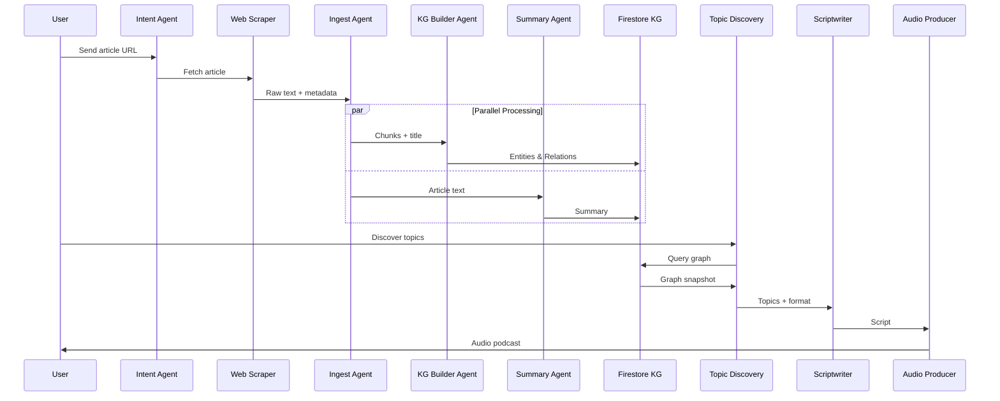
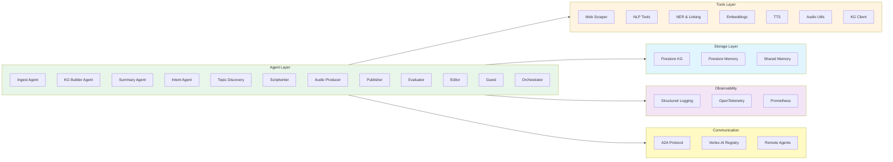
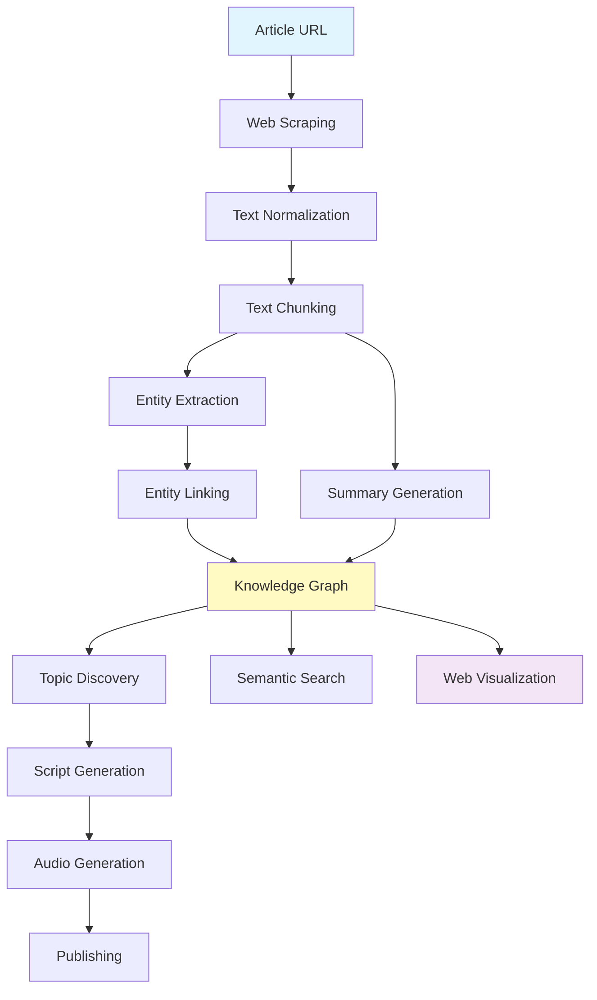

# TabSage Architecture

## System Overview

TabSage is a multi-agent system that processes articles and builds knowledge graphs. The architecture consists of 12 specialized agents working together through a coordinated pipeline.

## Complete System Architecture

For a complete overview of the entire system, see [ARCHITECTURE_OVERVIEW.md](ARCHITECTURE_OVERVIEW.md) with the full system diagram.

## Architecture Diagram

```mermaid
graph TB
    User[User via Telegram Bot] --> Intent[Intent Recognition Agent]
    
    Intent -->|URL| URLFlow[URL Processing Flow]
    Intent -->|Search| SearchFlow[Search Flow]
    Intent -->|Audio| AudioFlow[Audio Generation Flow]
    
    subgraph URLFlow[Article Processing Pipeline]
        URLFlow --> Scraper[Web Scraper Tool]
        Scraper --> Ingest[Ingest Agent]
        Ingest --> KG[KG Builder Agent]
        Ingest --> Summary[Summary Agent]
        KG --> Firestore[(Firestore Knowledge Graph)]
        Summary --> Firestore
    end
    
    subgraph SearchFlow[Search & Discovery]
        SearchFlow --> Topic[Topic Discovery Agent]
        Topic --> Guest[Guest Agent]
        Guest --> Firestore
    end
    
    subgraph AudioFlow[Audio Generation Pipeline]
        AudioFlow --> Scriptwriter[Scriptwriter Agent]
        Scriptwriter --> Audio[Audio Producer Agent]
        Audio --> Publisher[Publisher Agent]
        Scriptwriter --> Editor[Editor Agent]
        Editor --> Evaluator[Evaluator Agent]
    end
    
    Firestore --> Web[Web Interface]
    Firestore --> Search[Semantic Search]
    
    style User fill:#e1f5ff
    style Intent fill:#fff4e1
    style Ingest fill:#e8f5e9
    style KG fill:#e8f5e9
    style Summary fill:#e8f5e9
    style Firestore fill:#fff9c4
    style Web fill:#f3e5f5
```

## Agent Flow Diagram



## Component Architecture



## Data Flow



## Key Concepts Implemented

### 1. Multi-Agent System
- **12 Specialized Agents**: Each agent has a specific role
- **Sequential Pipeline**: Ingest → KG Builder → Summary
- **Parallel Processing**: KG Builder processes chunks in parallel
- **Loop Agents**: Topic Discovery iterates to find topics
- **A2A Communication**: Agents communicate via standard protocol

### 2. Tools
- **Custom Tools**: 14+ specialized tools
- **Long-running Operations**: Pause/resume via workflows
- **Tool Integration**: Seamless integration with agents

### 3. Sessions & Memory
- **InMemorySessionService**: Session management
- **FirestoreMemoryService**: Long-term memory
- **Shared Memory**: Inter-agent communication
- **Context Compaction**: Efficient context management

### 4. Observability
- **Structured Logging**: JSON logs with context
- **OpenTelemetry Tracing**: Distributed tracing
- **Prometheus Metrics**: Performance metrics

### 5. Agent Evaluation
- **Test Sets**: Comprehensive test cases
- **Evaluation Runner**: Automated evaluation
- **Regression Detection**: Performance monitoring

### 6. A2A Protocol
- **A2A Registry**: Centralized agent registry
- **Remote Agents**: Distributed agent execution
- **Standard Interface**: Protocol-based communication

