# TabSage - Complete System Architecture

## Overall System Architecture

This diagram shows the complete TabSage system architecture with all components, agents, tools, and data flows.

```mermaid
graph TB
    subgraph UserInterface[User Interfaces]
        Telegram[Telegram Bot]
        WebUI[Web Interface]
    end
    
    subgraph EntryPoint[Entry Point]
        IntentAgent[Intent Recognition Agent]
    end
    
    subgraph ProcessingPipeline[Article Processing Pipeline]
        WebScraper[Web Scraper Tool]
        IngestAgent[Ingest Agent]
        KGBuilderAgent[KG Builder Agent]
        SummaryAgent[Summary Agent]
    end
    
    subgraph DiscoveryPipeline[Topic Discovery & Audio Pipeline]
        TopicDiscoveryAgent[Topic Discovery Agent]
        ScriptwriterAgent[Scriptwriter Agent]
        AudioProducerAgent[Audio Producer Agent]
        PublisherAgent[Publisher Agent]
    end
    
    subgraph QualityPipeline[Quality Assurance Pipeline]
        EvaluatorAgent[Evaluator Agent]
        EditorAgent[Editor Agent]
    end
    
    subgraph ExpertSystem[Expert System]
        GuestAgent[Guest Agent]
    end
    
    subgraph Orchestration[Orchestration]
        Orchestrator[Orchestrator Agent]
    end
    
    subgraph ToolsLayer[Tools Layer]
        NLP[NLP Tools<br/>- Text cleaning<br/>- Chunking<br/>- Language detection]
        NER[NER & Entity Linking<br/>- Entity extraction<br/>- Entity normalization<br/>- Entity linking]
        Embeddings[Embeddings<br/>- Vertex AI Embeddings]
        TTS[TTS<br/>- Google Cloud TTS<br/>- SSML support]
        AudioUtils[Audio Utils<br/>- Normalization<br/>- Mixing<br/>- Segmentation]
        Cache[Cache<br/>- Function caching]
    end
    
    subgraph StorageLayer[Storage Layer]
        FirestoreKG[(Firestore<br/>Knowledge Graph)]
        FirestoreMemory[(Firestore<br/>Memory Service)]
        SharedMemory[Shared Memory<br/>Inter-agent communication]
    end
    
    subgraph ObservabilityLayer[Observability Layer]
        Logging[Structured Logging<br/>JSON logs]
        Tracing[OpenTelemetry<br/>Distributed tracing]
        Metrics[Prometheus<br/>Metrics on port 8000]
    end
    
    subgraph CommunicationLayer[Communication Layer]
        A2A[A2A Protocol<br/>Agent-to-Agent]
        Registry[Vertex AI<br/>Agent Registry]
        RemoteAgents[Remote Agents<br/>HTTP endpoints]
    end
    
    subgraph SearchLayer[Search Layer]
        SemanticSearch[Semantic Search<br/>Vertex AI Search]
        GraphSearch[Graph Search<br/>Firestore queries]
    end
    
    %% User Interface Connections
    Telegram --> IntentAgent
    WebUI --> FirestoreKG
    WebUI --> GraphSearch
    
    %% Entry Point to Pipelines
    IntentAgent -->|URL| ProcessingPipeline
    IntentAgent -->|Search| SearchLayer
    IntentAgent -->|Audio| DiscoveryPipeline
    
    %% Processing Pipeline Flow
    ProcessingPipeline --> WebScraper
    WebScraper --> IngestAgent
    IngestAgent --> KGBuilderAgent
    IngestAgent --> SummaryAgent
    KGBuilderAgent --> FirestoreKG
    SummaryAgent --> FirestoreKG
    
    %% Discovery Pipeline Flow
    FirestoreKG --> TopicDiscoveryAgent
    TopicDiscoveryAgent --> ScriptwriterAgent
    ScriptwriterAgent --> AudioProducerAgent
    AudioProducerAgent --> PublisherAgent
    ScriptwriterAgent --> EditorAgent
    EditorAgent --> EvaluatorAgent
    
    %% Quality Pipeline
    EvaluatorAgent --> EditorAgent
    EditorAgent --> ScriptwriterAgent
    
    %% Expert System
    FirestoreKG --> GuestAgent
    GuestAgent --> SharedMemory
    
    %% Orchestration
    Orchestrator --> ProcessingPipeline
    Orchestrator --> DiscoveryPipeline
    Orchestrator --> QualityPipeline
    
    %% Tools Usage
    IngestAgent --> NLP
    KGBuilderAgent --> NER
    KGBuilderAgent --> Embeddings
    AudioProducerAgent --> TTS
    AudioProducerAgent --> AudioUtils
    ProcessingPipeline --> Cache
    
    %% Storage Connections
    KGBuilderAgent --> FirestoreKG
    SummaryAgent --> FirestoreKG
    TopicDiscoveryAgent --> FirestoreKG
    GuestAgent --> FirestoreMemory
    Orchestrator --> SharedMemory
    
    %% Observability Connections
    ProcessingPipeline -.->|monitors| ObservabilityLayer
    DiscoveryPipeline -.->|monitors| ObservabilityLayer
    QualityPipeline -.->|monitors| ObservabilityLayer
    ObservabilityLayer --> Logging
    ObservabilityLayer --> Tracing
    ObservabilityLayer --> Metrics
    
    %% Communication Connections
    ProcessingPipeline -.->|A2A| CommunicationLayer
    DiscoveryPipeline -.->|A2A| CommunicationLayer
    QualityPipeline -.->|A2A| CommunicationLayer
    CommunicationLayer --> A2A
    CommunicationLayer --> Registry
    CommunicationLayer --> RemoteAgents
    
    %% Search Connections
    SearchLayer --> SemanticSearch
    SearchLayer --> GraphSearch
    GraphSearch --> FirestoreKG
    
    %% Styling
    classDef agent fill:#e8f5e9,stroke:#4caf50,stroke-width:2px
    classDef tool fill:#fff4e1,stroke:#ff9800,stroke-width:2px
    classDef storage fill:#e1f5ff,stroke:#2196f3,stroke-width:2px
    classDef observability fill:#f3e5f5,stroke:#9c27b0,stroke-width:2px
    classDef communication fill:#fff9c4,stroke:#fbc02d,stroke-width:2px
    classDef interface fill:#ffebee,stroke:#f44336,stroke-width:2px
    
    class IntentAgent,IngestAgent,KGBuilderAgent,SummaryAgent,TopicDiscoveryAgent,ScriptwriterAgent,AudioProducerAgent,PublisherAgent,EvaluatorAgent,EditorAgent,GuestAgent,Orchestrator agent
    class WebScraper,NLP,NER,Embeddings,TTS,AudioUtils,Cache tool
    class FirestoreKG,FirestoreMemory,SharedMemory storage
    class Logging,Tracing,Metrics observability
    class A2A,Registry,RemoteAgents communication
    class Telegram,WebUI interface
```

## System Components Legend

### Agents (12 total)
- **Intent Recognition Agent**: Routes user requests
- **Ingest Agent**: Text normalization and chunking
- **KG Builder Agent**: Entity and relationship extraction
- **Summary Agent**: Summary generation
- **Topic Discovery Agent**: Discovers topics from knowledge graph
- **Scriptwriter Agent**: Creates podcast scripts
- **Audio Producer Agent**: Generates audio podcasts
- **Publisher Agent**: Publishes audio content
- **Evaluator Agent**: Evaluates text and audio quality
- **Editor Agent**: Human-in-the-loop review
- **Guest Agent**: Simulates expert responses
- **Orchestrator**: Coordinates agent workflow

### Tools (14+)
- **Web Scraper**: Fetches and parses articles
- **NLP Tools**: Text processing utilities
- **NER & Entity Linking**: Named entity recognition and linking
- **Embeddings**: Vector embeddings generation
- **TTS**: Text-to-speech synthesis
- **Audio Utils**: Audio processing utilities
- **Cache**: Function result caching

### Storage
- **Firestore Knowledge Graph**: Persistent graph storage
- **Firestore Memory Service**: Long-term memory
- **Shared Memory**: Inter-agent communication

### Observability
- **Structured Logging**: JSON logs with context
- **OpenTelemetry**: Distributed tracing
- **Prometheus**: Performance metrics

### Communication
- **A2A Protocol**: Agent-to-agent communication
- **Vertex AI Registry**: Centralized agent registry
- **Remote Agents**: Distributed agent execution

### Search
- **Semantic Search**: Vertex AI Search integration
- **Graph Search**: Firestore-based graph queries

## Data Flow Summary

1. **User sends article URL** → Telegram Bot → Intent Agent
2. **Intent Agent routes** → Processing Pipeline
3. **Processing Pipeline**:
   - Web Scraper fetches article
   - Ingest Agent normalizes and chunks text
   - KG Builder Agent extracts entities/relationships (parallel)
   - Summary Agent generates summary (parallel)
   - Both save to Firestore KG
4. **Topic Discovery** → Reads from Firestore KG → Discovers topics
5. **Audio Generation**:
   - Scriptwriter creates script
   - Audio Producer generates audio
   - Publisher publishes content
   - Editor and Evaluator ensure quality
6. **User accesses** → Web Interface → Visualizes knowledge graph
7. **User searches** → Semantic/Graph Search → Returns results

## Key Architectural Patterns

- **Multi-Agent System**: 12 specialized agents
- **Pipeline Architecture**: Sequential processing with parallel execution
- **Tool-Based Design**: Agents use specialized tools
- **Layered Architecture**: Clear separation of concerns
- **Event-Driven**: Agents communicate via A2A protocol
- **Observable**: Full observability at every layer
- **Scalable**: Horizontal scaling via A2A and remote agents

